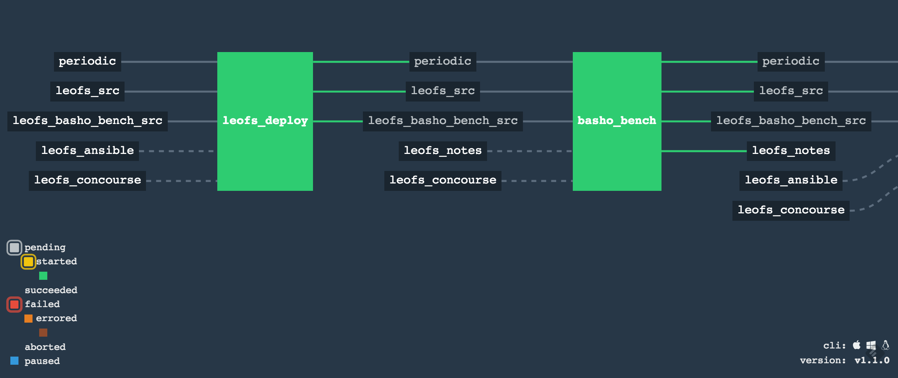
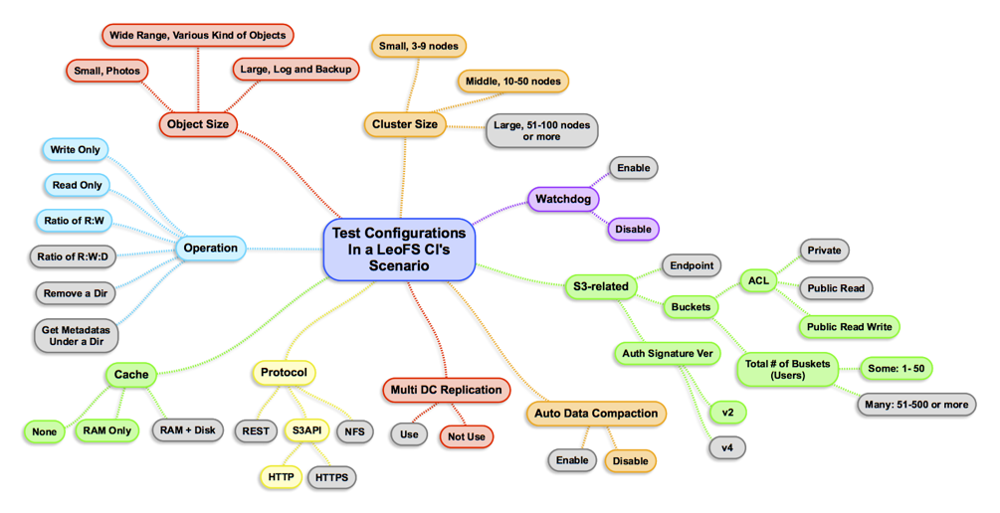

# A LeoFS' CI Tool with Concourse CI
A continuous integration tool for LeoFS' tests and shipment, which is powered by [Concourse CI](https://concourse.ci/index.html).

# Scenarios
## Basic Scenarios

| No.| Status   | Name                                                                                                              | Description                           |
|----|----------|-------------------------------------------------------------------------------------------------------------------|---------------------------------------|
| 1  | **Beta** | [Client Test w/LeoFS Ansible](https://github.com/leo-project/leofs_concourse/tree/master/S1)                      | S3 SDKs Test CI                       |
| 2  | **Beta**  | [Integration Test w/LeoFS Ansible](https://github.com/leo-project/leofs_concourse/tree/master/S2)                 | Functional Tests                      |
| 3  | ToDo     | [Multi Data Center Test w/LeoFS Ansible]()                                                                        | Multi Data Center Replication Test    |
| 4  | **Beta** | [Performance Test w/Basho Bench and LeoFS Ansible](https://github.com/leo-project/leofs_concourse/tree/master/S4) | Performance Test with [Basho Bench](https://github.com/leo-project/basho_bench) |
| 5  | ToDo     | [Build Test + Making packages for LeoFS shipment]()                                                               | Builing LeoFS' packages for a shipment|

## Optional Scenarios
In preparation

## Coverage
### Kind of a Test Configuration for LeoFS' CI
- As of July 22nd, 2016, LeoFS' CI, the automation test tool covers cobination of the configuration as below:

## Appendix
- See Also:
	- [LeoFS' Repository on GitHub](https://github.com/leo-project/leofs)
	- [LeoFS' Documentation](http://leo-project.net/leofs/docs/index.html)
	- [LeoFS' Ansible - For deployment and operation of LeoFS](https://github.com/leo-project/leofs_ansible)
	- [LeoFS' Functional Tests Tool](https://github.com/leo-project/leofs_test2)
	- [LeoFS' Notes - LeoFS' benchmark report](https://github.com/leo-project/notes)

## Sponsors

LeoProject/LeoFS is sponsored by [Rakuten, Inc.](http://global.rakuten.com/corp/) and supported by [Rakuten Institute of Technology](http://rit.rakuten.co.jp/).
